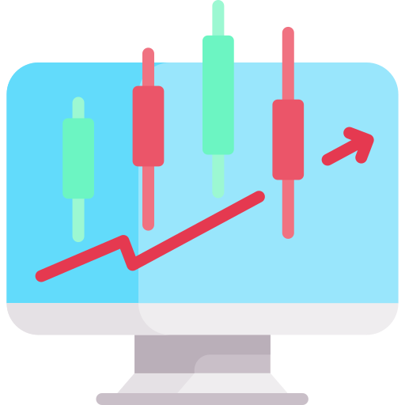
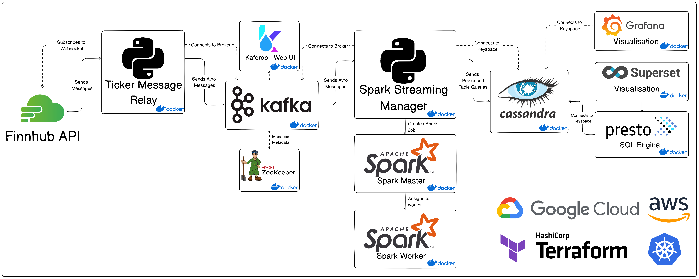

<a name="readme-top"></a>

<!-- PROJECT SHIELDS -->
[![Contributors][contributors-shield]][contributors-url]
[![Forks][forks-shield]][forks-url]
[![Stargazers][stars-shield]][stars-url]
[![Issues][issues-shield]][issues-url]
[![MIT License][license-shield]][license-url]


<!-- PROJECT LOGO -->
<br />
<div align="center">
  <a href="https://github.com/Data210/FinancialStreamingPipeline">
    
  </a>

<h3 align="center">Financial streaming pipeline</h3>

  <p align="center">
    Distributed scalable solution for streaming Finnhub data
    <br />
    <a href="https://github.com/Data210/FinancialStreamingPipeline"><strong>Explore the docs »</strong></a>
    <br />
    <br />
    <a href="https://github.com/Data210/FinancialStreamingPipeline">View Demo</a>
    ·
    <a href="https://github.com/Data210/FinancialStreamingPipeline/issues">Report Bug</a>
    ·
    <a href="https://github.com/Data210/FinancialStreamingPipeline/issues">Request Feature</a>
  </p>
</div>


<!-- TABLE OF CONTENTS -->
<details>
  <summary>Table of Contents</summary>
  <ol>
    <li>
      <a href="#about-the-project">About The Project</a>
      <ul>
        <li><a href="#built-with">Built With</a></li>
      </ul>
    </li>
    <li><a href="#license">License</a></li>
    <li><a href="#contact">Contact</a></li>
    <li><a href="#acknowledgments">Acknowledgments</a></li>
  </ol>
</details>


<!-- ABOUT THE PROJECT -->
# About The Project

This project makes use of the Finnhub.io websocket API as a source of live stock and crypto data. A distributed pipeline was built on top of the API to process, store and visualize real-time trade data on a web dashboard, in a manner that can be easily scaled up and deployed on the major cloud providers through Kubernetes or locally in Docker containers. The project makes use of Apache kafka for the messaging layer, Apache Spark for processing, Cassandra as the database solution, and Grafana or Apache Superset on top of Presto to connect to the databse and create dashboards.

<p align="right">(<a href="#readme-top">back to top</a>)</p>

### Built With
![Python][Python]
[![GCP][GCP]][gcp-url]
[![AWS][AWS]][aws-url]
![Docker][Docker]
![Kubernetes][Kubernetes]
![Terraform][Terraform]
![Apache Kafka][Apache Kafka]
![Apache Spark][Apache Spark]
![ApacheCassandra][ApacheCassandra]
![Grafana][Grafana]
![Presto][Presto]
![Apache Superset][Apache Superset]


<p align="right">(<a href="#readme-top">back to top</a>)</p>

# System Diagram


# Getting Started
For all of the following setup versions a [Finnhub](https://finnhub.io/) API key is required, you can get one by signing up to their website.
## Local Docker Setup
To set up locally you first need to create your `.env` from the `template.env` filling in the missing details.
Then, provided the Docker Daemon is running, you can navigate to the `/compose` directory, run `git clone https://github.com/apache/superset.git` in order to get the files needed to run Apache Superset. Then you can run `./run_docker.sh`. This will run the following commands:
```bash
docker compose down --remove-orphans # To bring down any containers that might be running.
docker compose build # To build the images.
docker compose up -d # To build the containers.
```
This should create the cluster of containers, with the visualisations available from `localhost:3000` for Grafana and `localhost:8088` for Superset.
## Local Kubernetes Setup using Kubernetes YML
To set up locally we developed using [Minikube](https://minikube.sigs.k8s.io/docs/start/) as a Kubernetes node cluster, so having that installed would be necessary first. Then [Kubectl](https://kubernetes.io/docs/tasks/tools/) is also required to be able to create the pods on the nodes. Once those prequisities are installed you can navigate to the `/k8s` directory and run `./run_k8s.sh`. This will run the following commands:
```bash
kubectl apply -f cassandra.yaml
kubectl apply -f zookeeper.yaml
kubectl apply -f kafka.yaml
kubectl apply -f websocket.yaml
kubectl apply -f spark_master.yaml
kubectl apply -f grafana.yaml
kubectl get pods -o wide # To see the state of the pods after creation
```
which should create the pods on the node cluster.
## Local Kubernetes Setup using Terraform
We also set up the local Kubernetes deployments and services to be able to be provisioned through [Terraform](https://developer.hashicorp.com/terraform/tutorials/aws-get-started/install-cli), which will be required to be installed for this set up. With Terraform installed as well as Minikube running you can navigate to `/terraform/local/`, in here you will have to create a `terraform.tfvars` file using the template provided, filling in the gaps of the variables. Once that is done all you need to do is run:
```bash
terraform apply
```
To create the kubernetes pods, and when you want to bring them all down again you run:
```bash
terraform destroy
```
## GCP Kubernetes Setup using Terraform
Setting up the project on Cloud services is similar to locally, first for GCP you will need to have created a project on GCP for kubernetes and enabled kubernetes engine. Then locally you need to have set up [GCloud CLI](https://cloud.google.com/sdk/docs/install) with the credentials to your account. After that you can navigate to `terraform/GCP/GKE` and `terraform/GCP/K8s` to create the `terraform.tfvars` files from the templates. With those created now you can deploy with `terraform apply` however it is important that you deploy the GKE cluster **First** as you cannot deploy the pods from `terraform/GCP/K8s` without the cluster being up first.
<br>
To access the Grafana dashboard from the GCP cluster you can run:
```bash
kubectl get nodes -o wide
```
Then you should be able to use the external ip of any of the nodes to access Grafana from `<external-ip>:30005`.
## AWS Kubernetes Setup using Terraform
Setting up the project on AWS is a similar process to setting it up on GCP, where first you need to install [AWS CLI](https://docs.aws.amazon.com/cli/latest/userguide/getting-started-install.html) and set it up with the credentials to your account. With that you can first navigate to `terraform/AWS/EKS` and run `terraform apply` in order to ensure the kubernetes cluster is up and running first. Then go to `terraform/AWS/K8s` and create the `terraform.tfvars` from the template, then run `terraform apply` to create the pods.
<br>
To access the Grafana dashboard from the AWS cluster you can run:
```bash
kubectl get services -o wide
```
To get the external ip of the Grafana service, which you then should be able to access from `<external-ip>:3000`.

<!-- LICENSE -->
# License

Distributed under the MIT License. See `LICENSE.txt` for more information.

<p align="right">(<a href="#readme-top">back to top</a>)</p>


<!-- CONTACT -->
# Contact

[![Linkedin][linkedin-shield-andre]](https://www.linkedin.com/in/andre-m-r/)
[![LinkedIn][linkedin-shield-ethan]](https://www.linkedin.com/in/ethan-jolly/)

<p align="right">(<a href="#readme-top">back to top</a>)</p>


<!-- ACKNOWLEDGMENTS -->
# Acknowledgments

* [RSKriegs](https://github.com/RSKriegs/finnhub-streaming-data-pipeline) for inspiration on the system architecture.

<p align="right">(<a href="#readme-top">back to top</a>)</p>

<!-- MARKDOWN LINKS & IMAGES -->
<!-- https://www.markdownguide.org/basic-syntax/#reference-style-links -->
[contributors-shield]: https://img.shields.io/github/contributors/Data210/FinancialStreamingPipeline.svg?style=for-the-badge
[contributors-url]: https://github.com/Data210/FinancialStreamingPipeline/graphs/contributors
[forks-shield]: https://img.shields.io/github/forks/Data210/FinancialStreamingPipeline.svg?style=for-the-badge
[forks-url]: https://github.com/Data210/FinancialStreamingPipeline/network/members
[stars-shield]: https://img.shields.io/github/stars/Data210/FinancialStreamingPipeline.svg?style=for-the-badge
[stars-url]: https://github.com/Data210/FinancialStreamingPipeline/stargazers
[issues-shield]: https://img.shields.io/github/issues/Data210/FinancialStreamingPipeline.svg?style=for-the-badge
[issues-url]: https://github.com/Data210/FinancialStreamingPipeline/issues
[license-shield]: https://img.shields.io/github/license/Data210/FinancialStreamingPipeline.svg?style=for-the-badge
[license-url]: https://github.com/Data210/FinancialStreamingPipeline/blob/master/LICENSE.txt
[linkedin-shield-andre]: https://img.shields.io/badge/-Andre_M.R.-black.svg?style=for-the-badge&logo=linkedin&colorB=555
[linkedin-shield-ethan]: https://img.shields.io/badge/-Ethan_Jolly-black.svg?style=for-the-badge&logo=linkedin&colorB=555
[linkedin-url]: https://linkedin.com/in/linkedin_username
[product-screenshot]: static/img/screenshot.PNG
[Python]:https://img.shields.io/badge/python-3670A0?style=for-the-badge&logo=python&logoColor=ffdd54
[GCP]: https://img.shields.io/badge/Google_Cloud-4285F4?style=for-the-badge&logo=google-cloud&logoColor=white
[gcp-url]: https://www.google.com/aclk?sa=l&ai=DChcSEwiknva15c__AhWM3-0KHfijAcAYABAAGgJkZw&sig=AOD64_1Jg8r0OVuZyqk6X5zRd5qaWHeKEQ&q&adurl&ved=2ahUKEwiagO-15c__AhVYOMAKHalsCt0Q0Qx6BAgEEAE
[AWS]: 	https://img.shields.io/badge/Amazon_AWS-FF9900?style=for-the-badge&logo=amazonaws&logoColor=white
[aws-url]: https://aws.amazon.com/
[Docker]: https://img.shields.io/badge/docker-%230db7ed.svg?style=for-the-badge&logo=docker&logoColor=white
[Kubernetes]: https://img.shields.io/badge/kubernetes-%23326ce5.svg?style=for-the-badge&logo=kubernetes&logoColor=white
[Apache Kafka]:https://img.shields.io/badge/Apache%20Kafka-000?style=for-the-badge&logo=apachekafka
[Apache Spark]:https://img.shields.io/badge/Apache%20Spark-FDEE21?style=for-the-badge&logo=apachespark&logoColor=black
[ApacheCassandra]: https://img.shields.io/badge/cassandra-%231287B1.svg?style=for-the-badge&logo=apache-cassandra&logoColor=white
[Grafana]: https://img.shields.io/badge/grafana-%23F46800.svg?style=for-the-badge&logo=grafana&logoColor=white
[Apache Superset]:https://img.shields.io/badge/Apache%20Superset-blue?style=for-the-badge&logo=apache
[Presto]:https://img.shields.io/badge/Presto-%235890FF?style=for-the-badge&logo=presto&logoColor=white
[Terraform]:https://img.shields.io/badge/terraform-%235835CC.svg?style=for-the-badge&logo=terraform&logoColor=white
